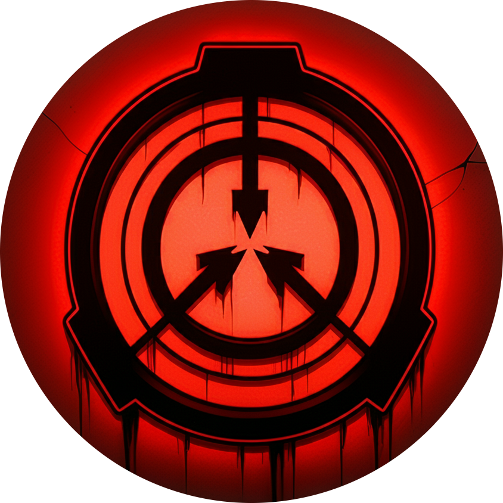

# SCP Foundation Database Interface

A web-based interface for accessing the SCP Foundation's database of anomalous entities and artifacts. This project recreates the experience of accessing a secure terminal within the SCP Foundation's network.

## Features

- 📱 Responsive design that works across desktop and mobile devices
- 🎵 Atmospheric background audio
- 🔍 Search functionality for SCP entries
- 📑 Detailed information cards for various SCP objects
- 🔐 Simulated security clearance system
- 📁 Classification-based organization (Safe, Euclid, Keter, Thaumiel)
- 🖱️ Custom context menu for enhanced immersion
- ⚠️ Data expungement and redaction effects

## Features in Detail

### Classification Pages
- Safe Class: Contains easily containable SCPs
- Euclid Class: Houses unpredictable SCPs
- Keter Class: Lists highly dangerous SCPs
- Thaumiel Class: Special containment SCPs

### Interactive Elements
- Hover effects on SCP entries
- Modal windows for detailed information
- Redacted text effects
- Custom right-click context menu
- Dynamic search functionality

### Audio Integration
The interface includes ambient background audio that enhances the atmosphere of accessing a secure database terminal.

## Browser Compatibility

- Chrome (recommended)
- Firefox
- Safari
- Edge

## Disclaimer

This is a fan-made project based on the SCP Foundation creative writing project. All SCP Foundation content is licensed under Creative Commons Share-alike 3.0.

---

**Remember:** You do not recognize the bodies in the water.
